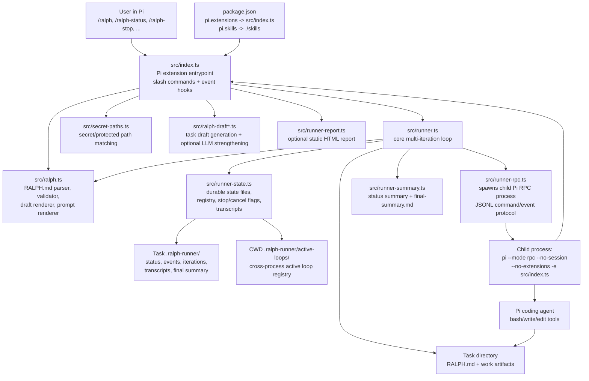
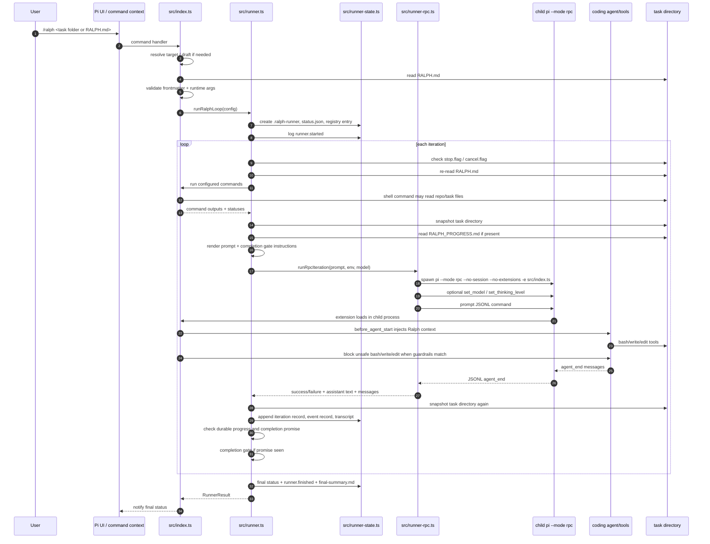
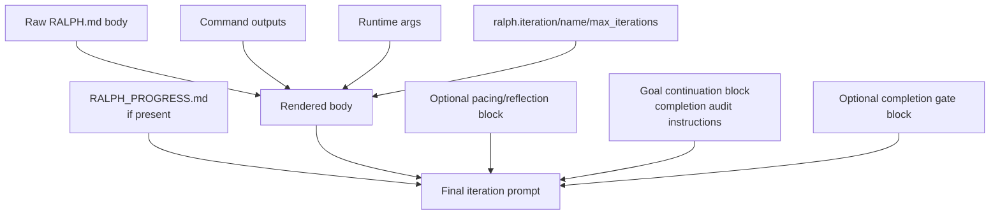
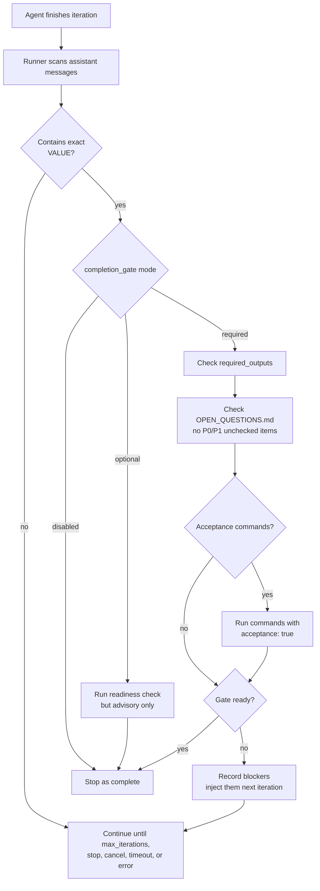
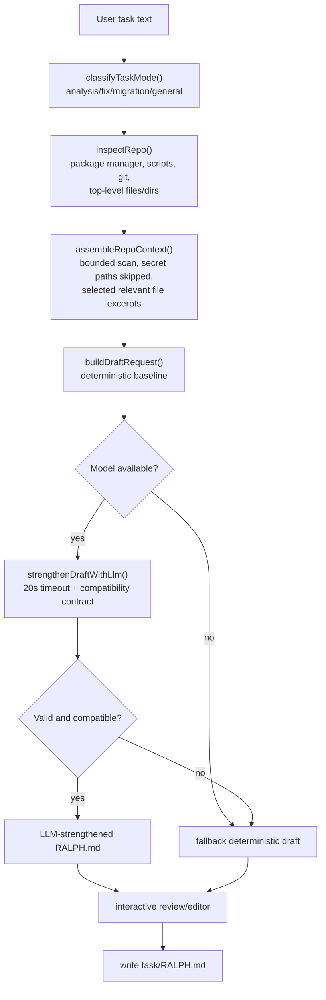

## Executive summary

`pi-ralph-loop` implements Ralph as a **Pi coding-agent extension**, not as a standalone shell command. The package manifest tells Pi to load `src/index.ts` as the extension and `./skills` as Pi skills, while the README explicitly says `/ralph` is a Pi slash command rather than a terminal executable.  ([GitHub][1])

A Ralph loop is centered on a **task directory**. The one human-authored file it fundamentally needs is:

```text
some-task/
└── RALPH.md
```

`RALPH.md` contains YAML frontmatter plus a Markdown body. The frontmatter defines loop limits, commands to run before each iteration, guardrails, completion behavior, required runtime args, and optional required output files. The body becomes the task prompt, with placeholders such as `{{ commands.tests }}`, `{{ ralph.iteration }}`, and `{{ args.foo }}` replaced at runtime. The parser/validator lives in `src/ralph.ts`.

At runtime, the extension creates and uses a durable state area:

```text
some-task/
├── RALPH.md                         # required task spec
├── RALPH_PROGRESS.md                # special rolling memory, usually agent-maintained
├── OPEN_QUESTIONS.md                # needed to pass required completion gate
├── <task outputs>                   # work artifacts the agent creates
└── .ralph-runner/
    ├── status.json
    ├── iterations.jsonl
    ├── events.jsonl
    ├── final-summary.md
    ├── stop.flag                    # only when /ralph-stop is requested
    ├── cancel.flag                  # only when /ralph-cancel is requested
    └── transcripts/
        └── iteration-001-<loopToken>.md
```

The core loop is in `src/runner.ts`. Each iteration re-reads `RALPH.md`, runs configured commands, snapshots the task directory, renders a prompt, spawns a child `pi --mode rpc` process with the extension loaded, waits for the agent to finish, detects durable file changes, records artifacts, and decides whether to continue or stop.

---

## Top-level architecture



The split is intentional. `src/index.ts` is the Pi integration layer: it registers slash commands, handles interactive drafting, wires UI notifications to the runner, executes configured shell commands, and installs tool-event guardrails. `src/runner.ts` is the autonomous loop. `src/runner-rpc.ts` isolates one agent iteration in a child Pi RPC process. `src/runner-state.ts` is the durable filesystem state layer.

---

## Files that are necessary

### 1. Necessary package files

For the extension package itself, the important checked-in pieces are:

```text
package.json
src/index.ts
src/ralph.ts
src/runner.ts
src/runner-rpc.ts
src/runner-state.ts
src/secret-paths.ts
src/ralph-draft.ts
src/ralph-draft-context.ts
src/ralph-draft-llm.ts
src/runner-summary.ts
src/runner-report.ts
presets/
skills/
README.md
```

The package manifest declares the package as `@lnilluv/pi-ralph-loop`, marks it as an ESM package, declares Node `>=22.22.1`, and lists runtime dependencies including `@mariozechner/pi-ai`, `minimatch`, and `yaml`, with `@mariozechner/pi-coding-agent` as a peer dependency.

The manifest’s `pi.extensions` entry points at `./src/index.ts`; that is why `/ralph` exists only inside Pi. The published package includes `assets`, `examples`, `presets`, `skills`, `src`, and `README.md`.

### 2. Necessary task-level file: `RALPH.md`

To run an existing loop directly, the task folder must contain `RALPH.md`, or the command must point directly at a `RALPH.md` file. `src/ralph.ts` treats only a directory with `RALPH.md` or a file literally named `RALPH.md` as runnable. Other Markdown files are rejected as “not runnable.”

A `RALPH.md` must have frontmatter. The strict inspector returns “Missing RALPH frontmatter” if it cannot match a frontmatter block, and `inspectDraftContent()` uses that strict path when validating a draft or run file.

A practical minimal shape is:

```md
---
commands: []
max_iterations: 10
timeout: 300
guardrails:
  block_commands:
    - "git\\s+push"
  protected_files: []
---

Task: do the thing.

Persist findings and outputs in this task folder.
```

Most fields have defaults when parsed: `commands: []`, `max_iterations: 50`, `inter_iteration_delay: 0`, `timeout: 300`, `required_outputs: []`, `stop_on_error: true`, and empty guardrails. The validator then enforces bounds, naming rules, safe required output paths, valid regexes, and command timeout limits.

### 3. Conditionally necessary files: `OPEN_QUESTIONS.md` and required outputs

`OPEN_QUESTIONS.md` is **not required to start** a loop. It becomes necessary when a completion promise is configured and the completion gate is not disabled. In `completion_gate: required` mode, the gate will block completion if `OPEN_QUESTIONS.md` is missing or still has unchecked P0/P1 items.

The same gate checks files listed in `required_outputs`, except it explicitly skips `RALPH_PROGRESS.md`. Missing required outputs block the gate.

The open-question parser recognizes P0/P1 sections and treats unchecked bullets under those sections as blockers; checked task-list items are treated as resolved.

---

## Files the tool creates by itself

### 1. Drafted or scaffolded `RALPH.md`

There are three ways the extension can create `RALPH.md` for you.

First, `/ralph "some task"` or `/ralph-draft "some task"` can draft a task folder. The draft flow classifies the task, inspects the repo, builds a `DraftRequest`, optionally asks an LLM to strengthen the deterministic draft, then writes the selected content to the target `RALPH.md` after review.

Second, `/ralph-scaffold` creates a non-interactive starter template. It resolves a task directory inside the current working directory, refuses unsafe/symlinked/out-of-root paths, refuses to overwrite an existing `RALPH.md` or a non-empty directory, and writes a template or preset `RALPH.md`.

Third, if a directory exists without `RALPH.md`, the interactive `/ralph` flow can ask whether to draft in that folder or treat the text as a task.

### 2. The task-local `.ralph-runner/` directory

The core runner creates `.ralph-runner/` in the task directory at startup and keeps it after the run for diagnostics. `runner-state.ts` defines the durable filenames: `status.json`, `iterations.jsonl`, `events.jsonl`, `stop.flag`, `cancel.flag`, `transcripts/`, and active-loop registry names.

The tool writes these files:

```text
task/
└── .ralph-runner/
    ├── status.json
    ├── iterations.jsonl
    ├── events.jsonl
    ├── final-summary.md
    ├── transcripts/
    │   ├── iteration-001-<loopToken>.md
    │   ├── iteration-002-<loopToken>.md
    │   └── ...
    ├── stop.flag
    └── cancel.flag
```

`status.json` is atomically rewritten with the current runner state. `iterations.jsonl` and `events.jsonl` are append-only JSONL ledgers. Transcript files are Markdown files containing a header, the rendered prompt, command outputs, and the assistant text or error outcome.

At the end of a run, `runner.ts` calls `writeRalphFinalSummary(taskDir)`, which writes `.ralph-runner/final-summary.md`. That summary includes status, completion gate state, recent iterations, changed files, `RALPH_PROGRESS.md`, transcript references, event count, and a suggested next action.

### 3. The active-loop registry under the command CWD

In addition to the task-local runner directory, the tool keeps an active-loop registry under the current working directory:

```text
<cwd>/
└── .ralph-runner/
    └── active-loops/
        └── <sha256(taskDir)>.json
```

This registry is how `/ralph-list`, cross-process `/ralph-stop`, and lifecycle lookup work. Entries contain `taskDir`, `ralphPath`, `cwd`, `loopToken`, status, current/max iteration, timestamps, and stop-request metadata. Entries older than 30 minutes are treated as stale.

If the task directory is also the current working directory, the task `.ralph-runner/` and registry `.ralph-runner/` are the same tree. If the task is a subdirectory, there are usually two `.ralph-runner` locations: one inside the task for the run artifacts, and one at the command CWD for the active-loop registry.

### 4. Stop and cancel flag files

`/ralph-stop` creates `.ralph-runner/stop.flag` in the task directory. The main loop checks that flag between iterations and exits after the current iteration. `stop.flag` is then cleared.

`/ralph-cancel` creates `.ralph-runner/cancel.flag`. The runner polls this during an active RPC iteration; when seen, it aborts the child process and ends the run as `cancelled`.

### 5. Archive and log export directories

`/ralph-archive` moves the task’s `.ralph-runner/` directory into:

```text
task/
└── .ralph-runner-archive/
    └── <timestamp>/
        ├── status.json
        ├── iterations.jsonl
        ├── events.jsonl
        ├── final-summary.md
        └── transcripts/
```

The archive code checks that the archive root is not a symlink, remains inside the task directory, and then renames `.ralph-runner` into the archive destination.

`/ralph-logs` exports evidence to an external destination, defaulting to a `ralph-logs-<timestamp>` directory. It copies `status.json`, writes a fresh `final-summary.md`, filters `iterations.jsonl` and `events.jsonl` to the current loop token when possible, copies matching transcripts, and optionally generates `report.html`.

### 6. `RALPH_PROGRESS.md`

`RALPH_PROGRESS.md` is special. The runner reads it as rolling memory and injects it into later iteration prompts, but the direct runner code does not have a “write progress file” function. In practice, the agent writes or edits it through normal tool calls when instructed. The runner treats it as loop memory: it reads at most 4096 characters, injects it as `[ralph progress memory]`, excludes it from progress snapshots, and skips it as a required-output blocker.

---

## `RALPH.md` frontmatter and body mechanics

The frontmatter type supports:

```yaml
commands:
  - name: tests
    run: npm test
    timeout: 120
    acceptance: true

args:
  - ticket

max_iterations: 25
inter_iteration_delay: 0
items_per_iteration: 3
reflect_every: 5
timeout: 300

completion_promise: DONE
completion_gate: required
required_outputs:
  - REPORT.md

stop_on_error: true

guardrails:
  shell_policy:
    mode: allowlist
    allow:
      - "npm test"
      - "npm run .*"
  block_commands:
    - "git\\s+push"
  protected_files:
    - "policy:secret-bearing-paths"
```

`src/ralph.ts` accepts both snake_case and camelCase aliases for several fields, validates numeric bounds, validates regexes, validates command and arg names, enforces safe relative `required_outputs`, and rejects overly broad protected-file globs.

The body supports placeholders:

```md
Task: fix issue {{ args.ticket }}

Latest tests:
{{ commands.tests }}

Iteration {{ ralph.iteration }} / {{ ralph.max_iterations }}
Task folder name: {{ ralph.name }}
```

At runtime, body rendering replaces command outputs, Ralph loop variables, and declared runtime args. Args used in shell commands are shell-quoted. HTML comments are removed from the rendered body.

Runtime args are only accepted with `/ralph --path ... --arg name=value`; args must be declared in frontmatter, every declared arg must be provided, and placeholders in the body or command strings must reference declared args.

---

## The runtime sequence



The critical design choice is that **each iteration is a new child Pi RPC process**. `runner-rpc.ts` defaults to spawning `pi --mode rpc --no-session --no-extensions -e <extensionPath>`, where `<extensionPath>` points back to `src/index.ts`. It sends JSONL commands such as `set_model`, `set_thinking_level`, and `prompt`, then waits for `agent_end`.

The parent passes a loop contract through environment variables: task dir, cwd, loop token, current iteration, max iterations, no-progress streak, and serialized guardrails. The child extension reads that contract so its event hooks know they are inside a Ralph iteration.

If the child contract is malformed, the child creates a fail-closed state that blocks all bash commands and all writes/edits.

---

## The iteration loop in detail

### Step 1: initialize durable state

At startup, `runRalphLoop()` derives `taskDir` from `ralphPath`, generates a `loopToken`, creates `.ralph-runner/`, writes initial `status.json`, writes an active-loop registry entry, logs `runner.started`, and starts a heartbeat that refreshes the registry every 60 seconds.

The initial status file contains `loopToken`, `ralphPath`, `taskDir`, `cwd`, `status`, `currentIteration`, `maxIterations`, `timeout`, `completionPromise`, `startedAt`, and `guardrails`.

### Step 2: check stop/cancel signals

Before every iteration, the loop checks for `stop.flag` and `cancel.flag`. A stop request exits after the current iteration boundary. A cancel request aborts the active child process and returns `cancelled`.

### Step 3: re-read `RALPH.md`

The runner re-parses `RALPH.md` on every iteration. That means the task file is live-editable while the loop is running: max iterations, timeout, completion promise, gate mode, required outputs, delay, guardrails, commands, and `stop_on_error` are refreshed each iteration.

This is important operationally: if a loop is stuck or too broad, editing `RALPH.md` can steer subsequent iterations without restarting.

### Step 4: run configured commands

Before prompting the agent, `runner.ts` asks `index.ts` to run the configured `commands`. Each command is checked against guardrails, runtime arg placeholders are resolved, output is bounded/truncated, and the result is recorded as `ok`, `blocked`, `timeout`, or `error`. Commands whose semantic command string starts with `./` run in the task directory; other commands run in the repo CWD.

Command outputs are then made available to the prompt through `{{ commands.<name> }}` placeholders.

### Step 5: snapshot durable progress

The runner snapshots the task directory before the agent runs. It ignores `.git`, `node_modules`, `.next`, `.turbo`, `.cache`, `coverage`, `dist`, `build`, `.ralph-runner`, `RALPH.md`, and `RALPH_PROGRESS.md`. It fingerprints up to 200 files and 2 MiB of content using `byteLength:sha1`.

After the agent finishes, it snapshots again and diffs fingerprints. If files changed, durable progress is `true`. If no files changed and the snapshot was complete, progress is `false`. If the snapshot was truncated or had read errors, progress is `unknown`.

This means chat-only progress does not count. Ralph is designed to reward durable task-folder artifacts.

### Step 6: render the prompt

Prompt rendering has several layers:



`renderIterationPrompt()` prefixes the prompt with `[ralph: iteration i/max]`. It can add pacing instructions, reflection checkpoints, a goal-continuation block that requires a completion audit, and a completion-gate block telling the agent when it may emit the configured promise.

### Step 7: run the agent in a child Pi RPC process

`runner-rpc.ts` spawns a child Pi process with stdin/stdout/stderr pipes. The child speaks JSONL. The parent optionally sends model and thinking-level commands, sends the prompt, starts the timeout after the prompt is sent, collects events, and considers the iteration successful only if the child acknowledges the prompt, emits `agent_end`, and exits cleanly.

Cancellation and timeout kill the subprocess tree with `SIGKILL` on Unix-like platforms.

### Step 8: child-process event hooks steer and guard the agent

Because the child Pi process loads `src/index.ts`, the same extension installs event hooks inside the child. Before the agent starts, the extension injects a “Ralph Loop Context” system-prompt section containing the iteration number, task directory, previous iteration summaries, last progress feedback, and instructions to persist findings to files rather than only reporting in chat.

The `tool_call` hook enforces guardrails on bash/write/edit tools. Bash commands are checked against `shell_policy` and `block_commands`; writes/edits are checked against `protected_files`. Blocked tool calls are logged as proof entries.

The extension also tracks write/edit tool calls and records successful task-directory writes, which helps distinguish true file progress from ambiguous cases.

### Step 9: record iteration artifacts

For each completed, failed, timed-out, or cancelled iteration, Ralph writes:

```text
.ralph-runner/iterations.jsonl
.ralph-runner/events.jsonl
.ralph-runner/transcripts/iteration-###-<loopToken>.md
```

An iteration record includes iteration number, status, timestamps, duration, progress state, changed files, no-progress streak, loop token, completion state, command outcomes, snapshot coverage, and RPC telemetry.

The transcript is intentionally human-readable: it includes the rendered prompt, command outputs, assistant text, completion metadata, and RPC telemetry.

---

## Completion and stopping behavior



A completion promise is not a fuzzy text match. The runner extracts `<promise>...</promise>` from assistant messages and compares it with the configured `completion_promise`.

If `completion_promise` exists and `completion_gate` is omitted, the default gate mode is `required`. If no completion promise exists, the completion gate is disabled.

When a promise is seen and the gate is enabled, `validateCompletionReadiness()` checks required outputs and `OPEN_QUESTIONS.md`. In required mode, if the gate passes and there are commands marked `acceptance: true`, the runner re-runs just those acceptance commands. Any non-OK acceptance outcome blocks completion.

If required completion is blocked, Ralph records the blocking reasons and continues. Those failure/rejection reasons are injected into later prompts so the agent can repair the missing evidence.

If the loop reaches its iteration limit without a completion promise, the final status becomes `max-iterations` if any iteration had confirmed durable progress, otherwise `no-progress-exhaustion`.

---

## Guardrails

Ralph has two guardrail layers: configured shell/file guardrails and built-in secret-path handling.

### Command guardrails

`block_commands` are regexes. A configured command or agent bash tool call matching a blocked regex is blocked. `shell_policy: allowlist` flips behavior: a bash command must match one of the allowlist regexes, otherwise it is blocked as `shell_policy.allowlist`.

### Protected-file guardrails

`protected_files` are matched against write/edit paths. A special token, `policy:secret-bearing-paths`, expands to secret-like paths. The implementation treats `.aws`, `.azure`, `.gcloud`, `.ssh`, `secrets`, `credentials`, `ops-secrets`, `credentials-prod`, `.npmrc`, `.pypirc`, `.netrc`, `.env*`, `*.pem`, `*.key`, and `*.asc` as secret-bearing. It normalizes paths, considers absolute and cwd-relative candidates, resolves symlinks where possible, and uses `minimatch` for normal glob patterns.

### What guardrails do not do

The frontmatter can block commands and protected writes, but Ralph is still an autonomous coding loop running inside Pi. The strongest controls in this repository are:

```text
- command regex blocklist / shell allowlist
- protected path matching for write/edit
- fail-closed child env contract
- bounded command output
- bounded/symlink-aware state reads/writes
- human-visible logs and transcripts
```

The implementation does not sandbox the whole operating system by itself; it relies on Pi’s tool model plus these extension hooks.

---

## How drafting works

When the user gives task text instead of a path, Ralph can draft the task folder and `RALPH.md`.



Mode classification is simple text matching: analysis tasks include words such as “reverse engineer,” “analyze,” “investigate,” “map,” “audit,” and “explore”; fix tasks include “fix,” “debug,” “repair,” “failing test,” and similar; migration tasks include “migrate,” “upgrade,” “convert,” “port,” or “modernize.”

Repo inspection detects package manager, scripts, git, top-level dirs/files, and chooses command intents. Analysis mode gets `repo-map` and optionally `git-log`; fix/general/migration modes prefer tests, verify, typecheck/check, build, lint, and git log when available.

The repo-context scanner is bounded: max scan depth 3, max 200 candidate paths, max 6 selected files, max 8000 bytes per file, and max 40,000 total bytes. It skips secret-bearing paths.

If LLM strengthening is available, the LLM must return a complete `RALPH.md` and obey a compatibility contract: command run strings must remain compatible, limits may not increase, guardrails remain fixed, and unsupported frontmatter changes fall back automatically.

---

## Slash commands and how they map to files

| Command           | What it does                              | Main files touched                                                             |
| ----------------- | ----------------------------------------- | ------------------------------------------------------------------------------ |
| `/ralph`          | Drafts or runs a Ralph loop               | May create `task/RALPH.md`; creates/updates `.ralph-runner/*`                  |
| `/ralph-draft`    | Drafts but does not start                 | Creates/edits `task/RALPH.md`                                                  |
| `/ralph-scaffold` | Non-interactive starter template          | Creates `task/RALPH.md`                                                        |
| `/ralph-list`     | Lists active loops                        | Reads `<cwd>/.ralph-runner/active-loops/*.json`                                |
| `/ralph-status`   | Shows current/durable run status          | Reads `status.json`, `iterations.jsonl`; `--summary` builds full summary       |
| `/ralph-resume`   | Starts a new run from existing `RALPH.md` | Reads `RALPH.md`, creates new run artifacts                                    |
| `/ralph-stop`     | Graceful stop after current iteration     | Writes `stop.flag`, updates registry                                           |
| `/ralph-cancel`   | Immediate cancellation                    | Writes `cancel.flag`                                                           |
| `/ralph-archive`  | Moves run artifacts aside                 | Moves `.ralph-runner/` to `.ralph-runner-archive/<timestamp>/`                 |
| `/ralph-logs`     | Exports logs/evidence                     | Creates export dir with status, summary, ledgers, transcripts, optional report |

The registrations are all in `src/index.ts`.

---

## The full file lifecycle

```mermaid
flowchart LR
    A["No task folder"] -->|/ralph 'task' or /ralph-draft| B["Draft target<br/><slug>/RALPH.md"]
    A -->|/ralph-scaffold| C["Scaffold target<br/>task/RALPH.md"]
    B --> D["User reviews/edits"]
    C --> D
    D --> E["Runnable task folder"]

    E -->|/ralph path| F["Initialize .ralph-runner"]
    F --> G["status.json<br/>events.jsonl<br/>active registry"]
    G --> H["Iteration N"]

    H --> I["Run commands"]
    I --> J["Render prompt"]
    J --> K["Child Pi RPC process"]
    K --> L["Agent creates/edits task files"]
    L --> M["Snapshot diff"]
    M --> N["iterations.jsonl<br/>events.jsonl<br/>transcript"]
    N --> O{"Completion?"}
    O -- no --> H
    O -- yes --> P["final status<br/>final-summary.md"]

    P --> Q["/ralph-status --summary"]
    P --> R["/ralph-logs --report"]
    P --> S["/ralph-archive"]
```



---

## Important operational implications

The loop is **file-first**. If the agent only explains progress in chat but does not change files in the task directory, Ralph usually records “no durable progress.” `RALPH.md` and `RALPH_PROGRESS.md` are intentionally ignored in snapshot progress detection, so updating the task spec or rolling memory alone does not count as durable task progress.

The loop is **live-editable**. Because `RALPH.md` is re-read every iteration, you can edit command lists, timeouts, guardrails, required outputs, and completion instructions while the run is ongoing.

The loop is **diagnosable by design**. It writes structured JSONL ledgers, a status file, per-iteration Markdown transcripts, final summaries, and optional exported HTML reports. The state writer uses atomic replacements, symlink checks, `O_NOFOLLOW` where available, bounded reads, and artifact-size caps.

The loop’s completion signal is **agent-authored but runner-verified**. The agent may say `<promise>DONE</promise>`, but in required gate mode the runner still checks real files, `OPEN_QUESTIONS.md`, and acceptance commands before it allows the loop to stop as complete.

[1]: https://github.com/lnilluv/pi-ralph-loop "https://github.com/lnilluv/pi-ralph-loop"

